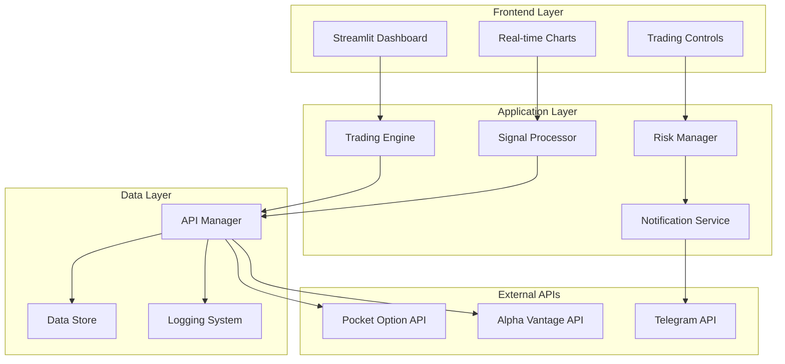

# Design Document

## Overview

The Pocket Option Trading Bot is designed as a modular, event-driven system that combines real-time market data analysis with automated trade execution. The architecture follows a clean separation of concerns with distinct layers for data acquisition, signal processing, trade execution, and user interface presentation.

The system operates on a hybrid synchronous/asynchronous model where the Streamlit frontend runs synchronously while the backend trading engine uses asyncio for concurrent API operations. This design ensures responsive UI interactions while maintaining efficient real-time data processing.

## Architecture

### High-Level Architecture



### Component Architecture

The system is organized into four main layers:

1. **Frontend Layer**: Streamlit-based web interface for user interaction
2. **Application Layer**: Core business logic and trading algorithms
3. **Data Layer**: API management, data persistence, and logging
4. **External APIs**: Third-party service integrations

## Components and Interfaces

### 1. API Manager (`src/backend/api_manager.py`)

**Purpose**: Centralized management of all external API interactions with connection pooling, rate limiting, and error handling.

**Key Methods**:
```python
class APIManager:
    async def get_market_data(self, symbol: str, timeframe: str) -> MarketData
    async def place_trade(self, trade_request: TradeRequest) -> TradeResponse
    async def get_account_balance(self) -> Balance
    async def validate_signal(self, symbol: str, signal: Signal) -> bool
    def send_notification(self, message: NotificationMessage) -> None
```

**Dependencies**: 
- `pocketoptionapi` for trading operations
- `requests` for Alpha Vantage API calls
- `python-telegram-bot` for notifications

### 2. Signal Processor (`src/backend/signal_processor.py`)

**Purpose**: Implements technical analysis algorithms and generates trading signals based on RSI and SMA indicators.

**Key Methods**:
```python
class SignalProcessor:
    def calculate_rsi(self, prices: List[float], period: int = 14) -> float
    def calculate_sma(self, prices: List[float], period: int = 20) -> float
    def generate_signal(self, market_data: MarketData) -> Optional[Signal]
    def validate_signal_strength(self, signal: Signal) -> float
```

**Algorithm Flow**:
1. Fetch recent price data (last 50 candles)
2. Calculate RSI(14) and SMA(20)
3. Apply signal generation rules:
   - BUY: RSI < 30 AND current_price > SMA
   - SELL: RSI > 70 AND current_price < SMA
4. Validate signal against Alpha Vantage data
5. Return signal with confidence score

### 3. Trading Engine (`src/backend/trading_engine.py`)

**Purpose**: Orchestrates the entire trading workflow from signal generation to trade execution.

**Key Methods**:
```python
class TradingEngine:
    async def start_trading(self, config: TradingConfig) -> None
    async def stop_trading(self) -> None
    async def process_trading_cycle(self) -> None
    def get_trading_status(self) -> TradingStatus
    def get_performance_metrics(self) -> PerformanceMetrics
```

**Trading Cycle**:
1. Check if trading is enabled and within trading hours
2. Fetch market data for configured currency pairs
3. Generate signals using SignalProcessor
4. Apply risk management rules
5. Execute trades if signals are valid
6. Log results and update performance metrics
7. Send notifications
8. Schedule next cycle (60-second intervals)

### 4. Risk Manager (`src/backend/risk_manager.py`)

**Purpose**: Implements risk controls and position management to protect capital.

**Key Methods**:
```python
class RiskManager:
    def validate_trade_request(self, request: TradeRequest) -> ValidationResult
    def check_daily_limits(self, account_balance: float) -> bool
    def calculate_position_size(self, balance: float, risk_percent: float) -> float
    def should_pause_trading(self, recent_losses: int) -> bool
```

**Risk Controls**:
- Maximum daily loss limit (5% of balance)
- Maximum trade size (2% of balance per trade)
- Consecutive loss circuit breaker (pause after 3 losses)
- Demo mode enforcement for new users

### 5. Streamlit Dashboard (`src/frontend/app.py`)

**Purpose**: Provides web-based interface for monitoring and controlling the trading bot.

**Key Components**:
```python
def render_dashboard():
    render_header_metrics()
    render_trading_controls()
    render_real_time_charts()
    render_trade_history()
    render_performance_analytics()

def render_trading_controls():
    # Start/Stop buttons
    # Currency pair selection
    # Trade amount configuration
    # Demo/Real mode toggle
```

**State Management**: Uses Streamlit's session state to maintain:
- Trading engine status
- Selected currency pairs
- User preferences
- Real-time data cache

## Data Models

### Core Data Structures

```python
@dataclass
class MarketData:
    symbol: str
    timestamp: datetime
    open_price: float
    high_price: float
    low_price: float
    close_price: float
    volume: float

@dataclass
class Signal:
    symbol: str
    signal_type: SignalType  # BUY or SELL
    confidence: float
    timestamp: datetime
    rsi_value: float
    sma_value: float
    current_price: float

@dataclass
class TradeRequest:
    symbol: str
    direction: TradeDirection
    amount: float
    expiration_time: int
    is_demo: bool

@dataclass
class TradeResult:
    trade_id: str
    symbol: str
    direction: TradeDirection
    amount: float
    entry_price: float
    exit_price: float
    profit_loss: float
    is_win: bool
    timestamp: datetime
```

### Database Schema

The system uses SQLite for local data persistence:

```sql
-- Trading history
CREATE TABLE trades (
    id INTEGER PRIMARY KEY,
    trade_id TEXT UNIQUE,
    symbol TEXT,
    direction TEXT,
    amount REAL,
    entry_price REAL,
    exit_price REAL,
    profit_loss REAL,
    is_win BOOLEAN,
    timestamp DATETIME
);

-- Performance metrics
CREATE TABLE daily_performance (
    date DATE PRIMARY KEY,
    total_trades INTEGER,
    winning_trades INTEGER,
    total_profit_loss REAL,
    win_rate REAL
);
```

## Error Handling

### Error Categories and Strategies

1. **API Errors**:
   - Connection timeouts: Retry with exponential backoff
   - Rate limiting: Implement request queuing
   - Authentication failures: Alert user and pause trading

2. **Trading Errors**:
   - Insufficient balance: Skip trade and log warning
   - Invalid symbol: Remove from trading pairs
   - Market closed: Pause until market opens

3. **System Errors**:
   - Memory issues: Implement cleanup routines
   - File I/O errors: Use alternative storage paths
   - Configuration errors: Validate on startup

### Circuit Breaker Pattern

```python
class CircuitBreaker:
    def __init__(self, failure_threshold: int = 5, timeout: int = 60):
        self.failure_threshold = failure_threshold
        self.timeout = timeout
        self.failure_count = 0
        self.last_failure_time = None
        self.state = "CLOSED"  # CLOSED, OPEN, HALF_OPEN
```

## Testing Strategy

### Unit Testing (80% Coverage Target)

**Backend Components**:
- `test_signal_processor.py`: Test RSI/SMA calculations with known datasets
- `test_trading_engine.py`: Mock API responses and test trading logic
- `test_risk_manager.py`: Test risk controls with edge cases
- `test_api_manager.py`: Test API integration with mock responses

**Test Data**:
- Historical price data for backtesting
- Mock API responses for offline testing
- Edge case scenarios (market gaps, API failures)

### Integration Testing

**API Integration Tests**:
- Test actual API connections in sandbox mode
- Validate data format consistency
- Test error handling with simulated failures

### End-to-End Testing with Playwright

**Frontend Testing**:
```python
async def test_trading_dashboard(page):
    await page.goto("http://localhost:8501")
    await page.click("[data-testid='start-trading-button']")
    await expect(page.locator(".trading-status")).to_contain_text("Active")
    
async def test_chart_rendering(page):
    await page.goto("http://localhost:8501")
    await expect(page.locator(".plotly-graph-div")).to_be_visible()
```

### Performance Testing

**Load Testing**:
- Simulate 100 concurrent trades
- Test memory usage over 24-hour periods
- Validate response times under load

**Backtesting Framework**:
```python
class BacktestEngine:
    def run_backtest(self, historical_data: List[MarketData], 
                    strategy: TradingStrategy) -> BacktestResults:
        # Simulate trading over historical data
        # Calculate win rate, profit/loss, drawdown
        # Generate performance report
```

## Security Considerations

### API Key Management

- Store credentials in environment variables
- Use encryption for sensitive configuration
- Implement key rotation capabilities
- Never log API keys or tokens

### Data Protection

- Encrypt local database files
- Secure WebSocket connections (WSS)
- Validate all user inputs
- Implement session timeouts

### Trading Security

- Default to demo mode for new installations
- Require explicit confirmation for real trading
- Implement trade amount limits
- Log all trading activities for audit

## Performance Optimizations

### Caching Strategy

- Cache market data for 30 seconds to reduce API calls
- Use Redis for distributed caching (future enhancement)
- Implement intelligent cache invalidation

### Async Operations

- Use asyncio for concurrent API calls
- Implement connection pooling for HTTP requests
- Use WebSocket connections for real-time data

### Memory Management

- Limit historical data retention (last 1000 trades)
- Implement periodic cleanup routines
- Use generators for large data processing

## Deployment and Scalability

### Local Deployment

```bash
# Environment setup
python -m venv venv
source venv/bin/activate  # Windows: venv\Scripts\activate
pip install -r requirements.txt

# Configuration
cp .env.example .env
# Edit .env with API keys

# Run application
streamlit run src/frontend/app.py
```

### Future Scalability Considerations

- Containerization with Docker
- Microservices architecture for multiple trading pairs
- Cloud deployment with auto-scaling
- Database migration to PostgreSQL for production

## Monitoring and Observability

### Logging Strategy

```python
import logging

# Configure structured logging
logging.basicConfig(
    level=logging.INFO,
    format='%(asctime)s - %(name)s - %(levelname)s - %(message)s',
    handlers=[
        logging.FileHandler('trading_bot.log'),
        logging.StreamHandler()
    ]
)
```

### Metrics Collection

- Trade execution latency
- API response times
- Win/loss ratios
- System resource usage
- Error rates by component

### Health Checks

- API connectivity status
- Database connection health
- Memory and CPU usage
- Trading engine status
- Last successful trade timestamp